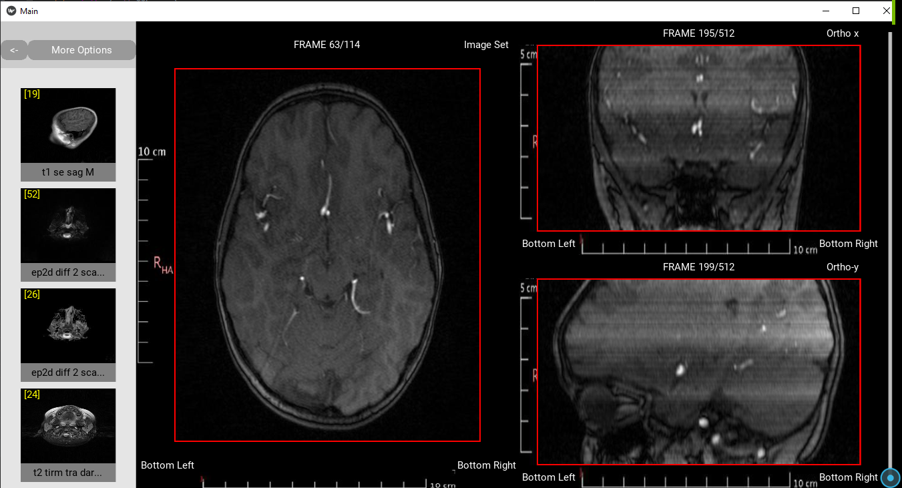

# MRI IMAGE PROCESSING

This is a software to view MRI images built on Kivy.

## Demo

Here is a demo of the app.

https://github.com/bassammmm/MRI-Image-Processor/blob/main/ss/demo.wmv


## Screenshots

Main Page -



## Installation

Clone and install the requirements from requirements.txt

```bash
  pip install -r requirements.txt 
```

Once the requirements are properly installed, run the application from run.py .

```bash
  python main.py 
```
